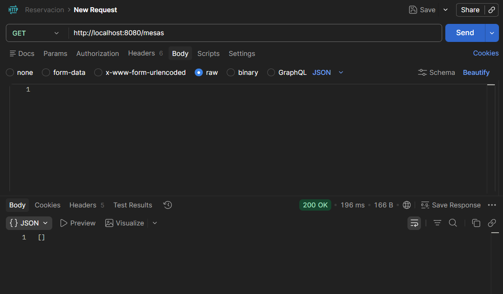
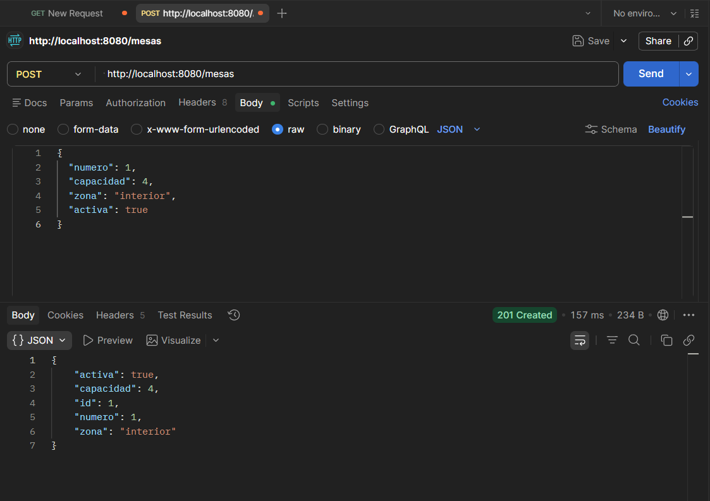
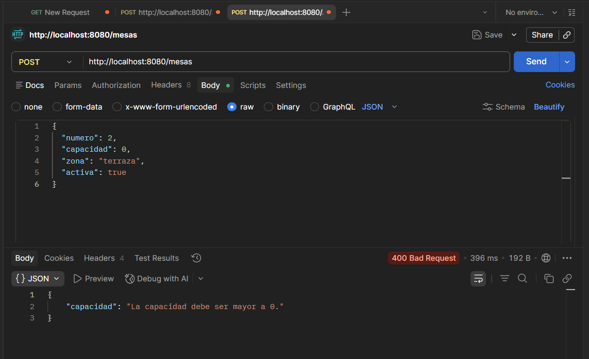
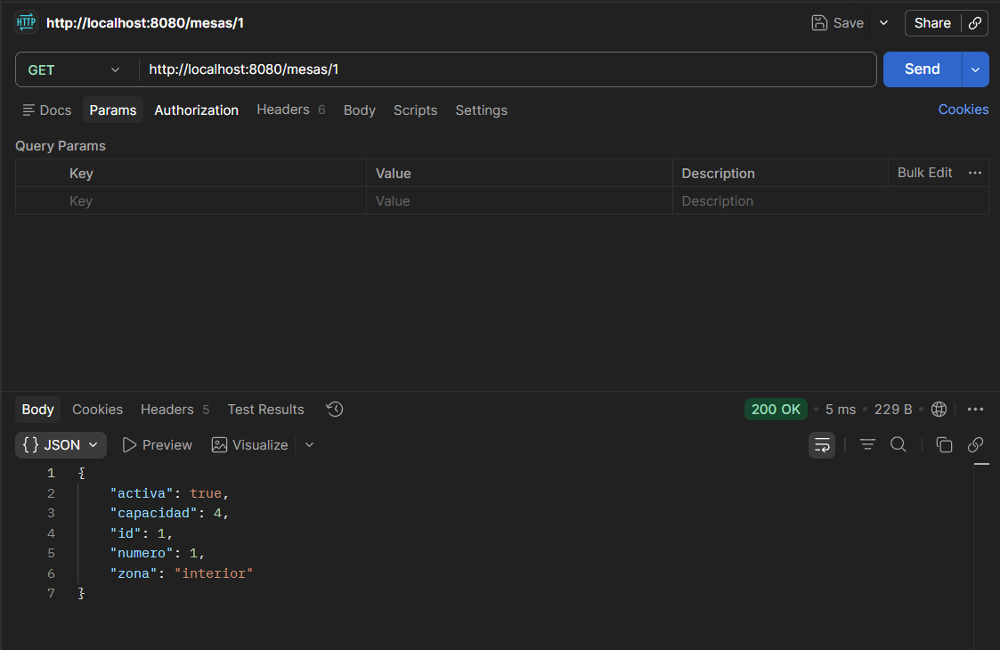
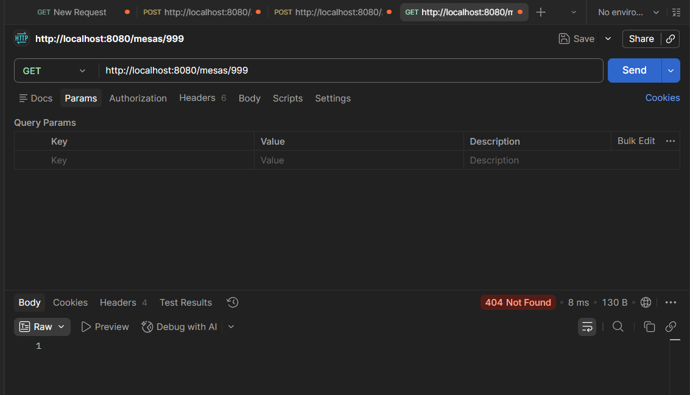
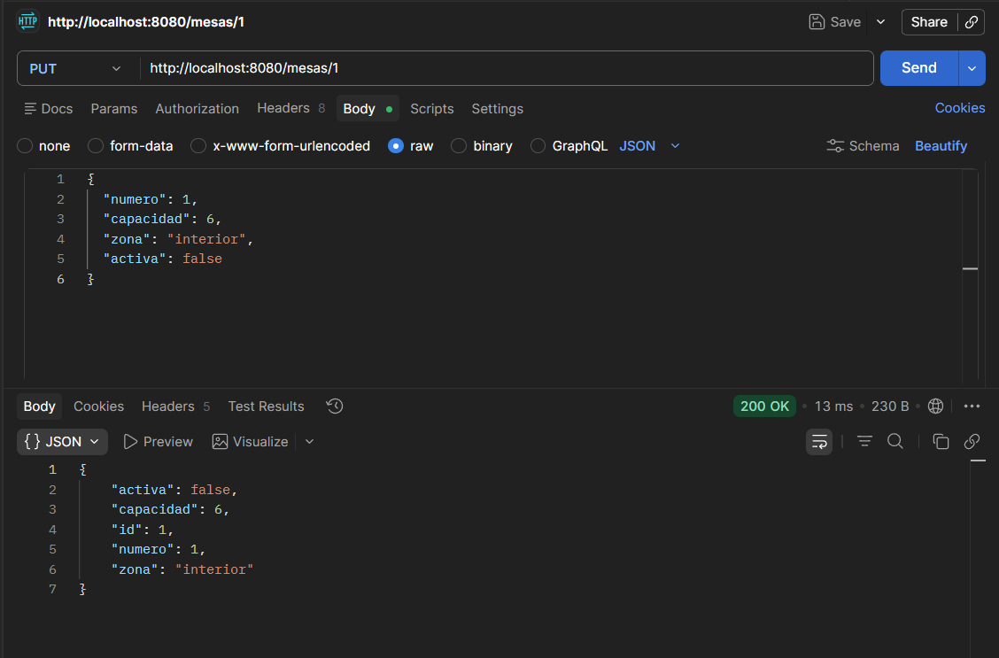
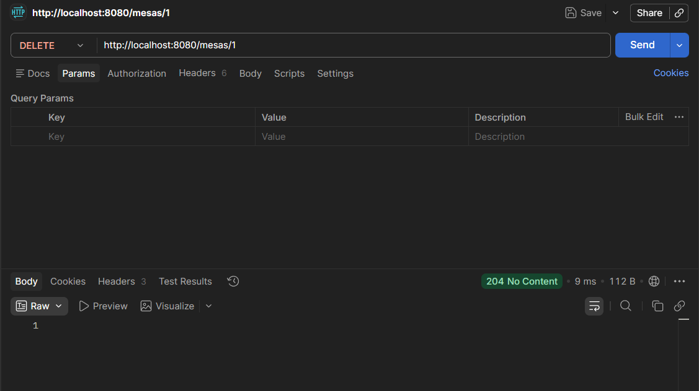

# Backend Restaurante - Previo P2

Proyecto backend REST desarrollado con Spring Boot para la gestion de mesas y reservas de un restaurante.

## Estudiante

- Nombre: **Sebastian Soledad**
- Codigo: **1152172**

## Tecnologias

- Java
- Spring Boot Web
- Maven
- Almacenamiento en memoria (`List<T>`, sin base de datos)

## Estructura del proyecto

Se implementó la arquitectura por capas:

- `model`
- `dao`
- `service`
- `controller`

Rutas clave:

- `src/main/java/com/universidad/soledadpreviop2web/model`
- `src/main/java/com/universidad/soledadpreviop2web/dao`
- `src/main/java/com/universidad/soledadpreviop2web/service`
- `src/main/java/com/universidad/soledadpreviop2web/controller`

## Lo que se implemento

### 1) Modelos (JavaBeans)

- `Mesa`
  - `id`, `numero`, `capacidad`, `zona`, `activa`
- `Reserva`
  - `id`, `mesaId`, `clienteNombre`, `fecha`, `horaInicio`, `horaFin`, `numPersonas`

Ambos con constructor vacio + getters/setters.

### 2) DAOs en memoria (`@Repository`)

- `MesaDAO`
  - Lista privada en memoria
  - Contador estatico para IDs autoincrementales
  - CRUD basico
  - `findById` retorna `null` si no existe

- `ReservaDAO`
  - Lista privada en memoria
  - Contador estatico para IDs autoincrementales
  - CRUD basico
  - `findById` retorna `null` si no existe
  - `findByMesa(int mesaId)` implementado con Streams (`filter` + `collect`)

### 3) Services (`@Service` + `@Autowired`)

- `MesaService`
  - Operaciones CRUD
  - Validacion para mesa:
    - `capacidad > 0`
    - `zona` obligatoria

- `ReservaService`
  - Operaciones CRUD y `findByMesa`
  - Metodo `validar(Reserva)` retorna `Map<String, String>`
  - Reglas implementadas:
    - `mesaId` debe existir
    - mesa debe estar activa
    - `clienteNombre` no nulo y minimo 3 caracteres con `trim()`
    - `horaFin` posterior a `horaInicio` (comparacion lexicografica)
    - `numPersonas > 0`
    - `numPersonas <= capacidad` real de la mesa

### 4) Controladores

#### `AuthController` (`/auth`)

- Usuarios hardcodeados:
  - `mesero1 / mes123`
  - `mesero2 / mes456`
  - `supervisor / sup789`
- Login:
  - crea sesion con `request.getSession(true)`
  - timeout: `setMaxInactiveInterval(1800)`
- Logout:
  - invalida sesion

#### `MesaController` (`/mesas`)

- Publico (sin sesion)
- CRUD completo
- Codigos HTTP usados:
  - `200` OK
  - `201` Created
  - `204` No Content
  - `404` Not Found
  - `400` Bad Request (cuando la validacion falla, por ejemplo capacidad 0)

#### `ReservaController` (`/reservas`)

- Requiere sesion en cada endpoint (`verificarSesion` con `getSession(false)`)
- En POST de reserva:
  - crea cookie `ultimaMesa`
  - `setMaxAge(604800)`
  - `setHttpOnly(true)`
- En GET de reservas:
  - lee cookie `ultimaMesa`
  - agrega header `X-Ultima-Mesa`

## Endpoints principales

### Auth

- `POST /auth/login`
- `POST /auth/logout`

### Mesas

- `GET /mesas`
- `GET /mesas/{id}`
- `POST /mesas`
- `PUT /mesas/{id}`
- `DELETE /mesas/{id}`

### Reservas

- `GET /reservas`
- `GET /reservas/{id}`
- `POST /reservas`
- `PUT /reservas/{id}`
- `DELETE /reservas/{id}`

## Como ejecutar

En la raiz del proyecto:

```powershell
.\mvnw.cmd spring-boot:run
```

URL base esperada:

- `http://localhost:8080`

## Como ejecutar tests

```powershell
.\mvnw.cmd -q test
```

## Evidencias Postman

Las capturas fueron guardadas en `src/main/resources/evidencias`:

1. `GET /mesas` (lista vacia inicial)  
   

2. `POST /mesas` con datos validos -> `201`  
   

3. `POST /mesas` con `capacidad = 0` -> `400`  
   

4. `GET /mesas/{id}` existente -> `200`  
   

5. `GET /mesas/{id}` inexistente -> `404`  
   

6. `PUT /mesas/{id}` -> `200`  
   

7. `DELETE /mesas/{id}` -> `204`  
   

## Nota

Todo el almacenamiento se realiza en memoria para cumplir el alcance del previo (sin persistencia en base de datos).

